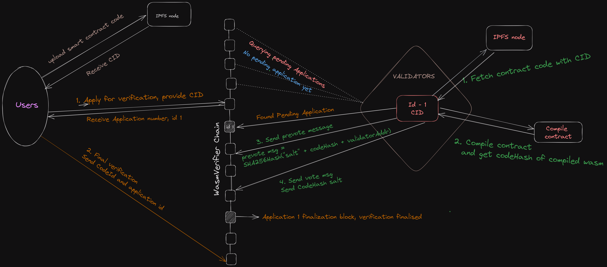
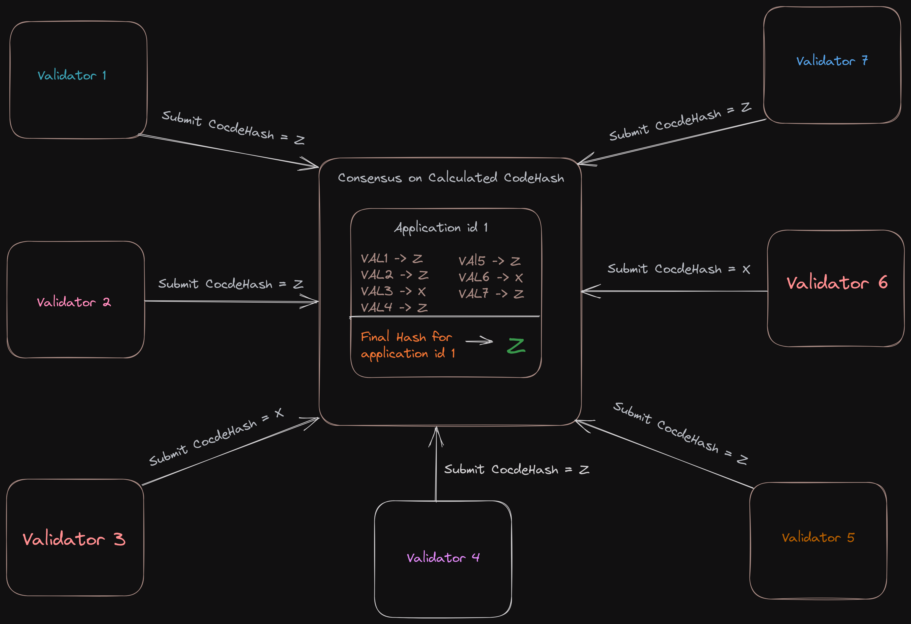

# wasmverify-v0
Wasm binary verification module with inbuilt verification consensus

## WasmVerifier
### Context
The primary purpose of wasmverifier module is to establish code integrity, preventing discrepancies that could lead to mistrust and suspicion of malicious intent of a smart contract. Users can review the code, enabling them to make informed decisions.

### Description

<!-- The wasmverifier module enables users to verify the offchain contract code with the onchain smart contract in a totally decentralised way.  Users apply for verification of off-chain contract code after uploading it on IPFS node. After it, validators come into action and they download the contract code from Ipfs node, compile them and calculate the hash of the compiled wasm. Validators then submit the hash. Consensus happens on the submitted hash and finalized hashed is then stored in the blockchain. User in the next step send the code-id of the on-chain smart contract and verify that the offchain code specified in the veification application is really the respective code of the code-id sent in the second step. -->

The wasmverifier module enables users to verify off-chain contract code with on-chain smart contracts in a decentralized manner. Users first request verification after uploading their code to an IPFS node. Validators download, compile, and calculate the hash of the wasm code, submitting this hash for consensus. The agreed-upon hash is then stored on the blockchain. In the next step, users confirm that the off-chain code they submitted matches the code associated with the on-chain smart contract code-ID.


### Wasmverifier module working flow

<!-- Any cosmos chain which has integrated wasmd module for smart contract can integrate Wasmverifier module in their blockchain. The working mechanism in nutshell : -->
Any Cosmos blockchain that has integrated the wasmd module for smart contracts can also seamlessly integrate the Wasmverifier module into their blockchain. In summary, the Wasmverifier module's operation can be described as follows:

<!-- - User will first upload the smart contract code on IPFS node and get the cid/url of it.
- Here starts the wasmverifier module's work. The contract Verification step involve two transactions. In first tx, user will apply for verification which they will do by sending a txn apply-verify-application and provide cid/url for the smart contract code uploaded on IPFS. Internally module decides the final verification block till when finalise hash of the offchain code will get uploaded. Till then user waits for making the second txn.
- When the module have any pending verification application, validators fetch the current pending application(there can be many application, they wait in queue for there time) download the code from the ipfs node, compile it and calculates the hash the compiled wasm file.
- Now validators have to submit the hash they got from the above process to the module. It happens in two  steps. In the first step, validator will first calculate the prevote msg which is the hash of the wasm hash along with the salt(prevotemsg = Hash(codeHash+salt)). This is to force the validators to follow the process and get the code hash. Now validator will make the aggregate-codehash-prevote transaction and send the prevote msg in it. this has to be done before the time allocated for validator to submit it for this application id.
- Now in the second step, validator will make the  other txn, aggregate-code-hash vote and sends the actual hash of the compiled wasm. Here validators work end for this application id(he will for the next application which will come after this application).

- Now at the end of the assigned block height for this application, module calculates the  final hash out of all the  submitted hash from the validators and stores it the blockchain.

- Now, as previously said, user can make the second transaction, which is final-verification and send the code-id of the on-chain contract that they wants to verify with. Interally wasmverifier module fetches the codehash for this code-id from blockchain and match it with the finalize hash(from the previous step). If both hashes gets matched then this code-id gets mapped with the off-chain code url and stored in the blockchain. User can verify it by quering the blockchain. User will get error while making the transaction if it not matching. -->



- To initiate the process, a user uploads their smart contract code onto an IPFS node and receives a unique CID/URL for it.

- The operation of the Wasmverifier module unfolds in two key transactions. In the first transaction, the user applies for verification by sending a "apply-verify-application" transaction, providing the CID/URL of the smart contract code uploaded to IPFS. The module internally determines the final verification block where the hash of the off-chain code will be uploaded. During this period, the user waits for the second transaction.

- While the module has pending verification applications, validators select the current pending application (as there may be multiple applications waiting in a queue), download the code from the IPFS node, compile it, and calculate the hash of the compiled WebAssembly (wasm) file.

- Validators are required to submit the hash they obtained through a two-step process. In the first step, validators calculate a "prevote msg," which combines the hash of the wasm code and a salt (prevotemsg = Hash(codeHash+salt)). This ensures that validators adhere to the process and obtain the code hash. They then execute the "aggregate-codehash-prevote" transaction, sending the prevote msg. This must be completed within the allocated time for the specific application ID.



- In the second step, validators execute another transaction, "aggregate-code-hash vote," in which they send the actual hash of the compiled wasm code. This concludes the validator's role for the current application ID, and they await the next one.

- At the end of the assigned block height for the application, the module calculates the final hash from all the submitted hashes by the validators and stores it on the blockchain.

- Subsequently, the user can proceed with the second transaction, "final-verification," in which they provide the code-ID of the on-chain contract they wish to verify. The Wasmverifier module internally retrieves the codehash for this code-ID from the blockchain and matches it with the finalized hash obtained in the previous step. If both hashes match, the code-ID is associated with the off-chain code URL and recorded on the blockchain. In case of a mismatch, the user will encounter an error when attempting the transaction.

### Transaction messages

#### Receive Application for verification
```go
func (k msgServer) ApplyVerifyApplication(goCtx context.Context, msg *types.MsgApplyVerifyApplication) (*types.MsgApplyVerifyApplicationResponse, error) {
	ctx := sdk.UnwrapSDKContext(goCtx)

	id := k.handleApplication(ctx, msg)

	return &types.MsgApplyVerifyApplicationResponse{
		ApplicationId: id,
	}, nil
}
```
#### Receive Prevote from validator

```go
func (k msgServer) AggregateCodeHashPrevote(goCtx context.Context, msg *types.MsgAggregateCodeHashPrevote) (*types.MsgAggregateCodeHashPrevoteResponse, error) {

	valAddr, err := sdk.ValAddressFromBech32(msg.Validator)
	if err != nil {
		return nil, err
	}
	// Verify the voter is validator
	if err := k.ValidateValidator(ctx, valAddr); err != nil {
		return nil, err
	}
	// Check Already voted..?
	if k.HasAggregateCodeHashPrevote(ctx, valAddr) {
		return nil, types.ErrExistingPrevote
	}
	// Check if the prevote made by validator is in the vote period for the penidg Contarct
	finalPrevoteTime, err := k.GetContractPrevoteTime(ctx, msg.ApplicationId)
	if err != nil {
		return nil, err
	}
	if uint64(ctx.BlockHeight()) > finalPrevoteTime {
		return nil, types.ErrPreVoteTimePassed
	}
    // Save prevote
	aggregatePrevote := types.CodeHashPreVote{
		ApplicationId: msg.ApplicationId,
		Hash:          msg.Hash,
		Voter:         msg.Validator,
		SubmitBlock:   uint64(ctx.BlockHeight()),
	}
	k.SetAggregateCodeHashPrevote(ctx, valAddr, aggregatePrevote)

	return &types.MsgAggregateCodeHashPrevoteResponse{}, nil
}
```

#### Receive Vote from validator

```go

func (k msgServer) AggregateCodeHashVote(goCtx context.Context, msg *types.MsgAggregateCodeHashVote) (*types.MsgAggregateCodeHashVoteResponse, error) {

	validateValidator(msg.validator)
	contractInfo, found := k.GetContractInfo(ctx, msg.ApplicationId)
	if !found {
		return nil, types.ErrContractInfoNotFound
	}
	finalPrevoteTime, err := k.GetContractPrevoteTime(ctx, msg.ApplicationId)
	if err != nil {
		return nil, err
	}
    // Check vote timing
	if (uint64(ctx.BlockHeight()) > contractInfo.AssignedVerificationBlockHeight) || (uint64(ctx.BlockHeight()) < finalPrevoteTime) {
		return nil, types.ErrVoteTiming
	}
	aggregatePrevote, err := k.GetAggregateCodeHashPrevote(ctx, valAddr)
	if err != nil {
		return nil, types.ErrNoAggregatePrevote.Wrap((msg.Operator + " for appId: " + string(msg.ApplicationId)))
	}
	// Verify prevote msg with hash(vote)
	hash := types.GetAggregateVoteHash(msg.Salt, msg.CodeHash, msg.Operator)
	if aggregatePrevote.Hash != hex.EncodeToString(hash) {
		return nil, types.ErrVerificationFailed.Wrapf("must be given %s not %s", aggregatePrevote.Hash, hash)
	}
	// Save vote, delete prevote
	aggregateCodeHashVote := types.CodeHashVote{
		ApplicationId: msg.ApplicationId,
		CodeHash:      msg.CodeHash,
		Voter:         valAddr.String(),
	}
	k.SetAggregateCodeHashVote(ctx, valAddr, aggregateCodeHashVote)
	k.DeleteAggregateCodeHashPrevote(ctx, valAddr)

	return &types.MsgAggregateCodeHashVoteResponse{}, nil
}
```

#### FinalVerification msg (sent by user)

```go
func (k msgServer) FinalVerification(goCtx context.Context, msg *types.MsgFinalVerification) (*types.MsgFinalVerificationResponse, error) {

	status, err := k.verifyHash(ctx, msg)
	if err != nil {
		return nil, err
	}

	return &types.MsgFinalVerificationResponse{
		Response: status,
	}, nil
}
```

### Query Messages

#### Query Current Pending Contract(return application id)
```go
func (k Keeper) CurrentPendingContract(goCtx context.Context, req *types.QueryCurrentPendingContractRequest) (*types.QueryCurrentPendingContractResponse, error) {
	if req == nil {
		return nil, status.Error(codes.InvalidArgument, "invalid request")
	}
	ctx := sdk.UnwrapSDKContext(goCtx)
	currentPendingContractId := k.GetCurrentPendingContractId(ctx)
	if currentPendingContractId == 0 {
		return nil, types.ErrNoPendingContractfound
	}

	return &types.QueryCurrentPendingContractResponse{
		Id: currentPendingContractId,
	}, nil
}
```

#### Query Contract-info(search with application id )

```go
func (k Keeper) ContractInfo(goCtx context.Context, req *types.QueryContractInfoRequest) (*types.QueryContractInfoResponse, error) {
	if req == nil {
		return nil, status.Error(codes.InvalidArgument, "invalid request")
	}
	ctx := sdk.UnwrapSDKContext(goCtx)
	contractinfo, found := k.GetContractInfo(ctx, req.Id)
	if !found {
		return nil, status.Error(codes.NotFound, "Contract Not Found")
	}

	return &types.QueryContractInfoResponse{
		Contractinfo: &contractinfo,
	}, nil
}
```

#### Query application id of the verified contract, to get metadata(After querying contract info)

```go
func (k Keeper) VerifiedMetaData(goCtx context.Context, req *types.QueryGetVerifiedMetaDataRequest) (*types.QueryGetVerifiedMetaDataResponse, error) {
	if req == nil {
		return nil, status.Error(codes.InvalidArgument, "invalid request")
	}
	ctx := sdk.UnwrapSDKContext(goCtx)
	val, found := k.GetVerifiedMetaData(
		ctx,
		req.CodeId,
	)
	if !found {
		return nil, status.Error(codes.NotFound, "not found")
	}
    // val contains application id
	return &types.QueryGetVerifiedMetaDataResponse{VerifiedMetaData: val}, nil
}
```
#### Query all verified application id 

```go
// GetAllVerifiedMetaData returns all verifiedMetaData
func (k Keeper) GetAllVerifiedMetaData(ctx sdk.Context) (list []types.VerifiedMetaData) {
	store := prefix.NewStore(ctx.KVStore(k.storeKey), types.KeyPrefix(types.VerifiedMetaDataKeyPrefix))
	iterator := sdk.KVStorePrefixIterator(store, []byte{})

	defer iterator.Close()

	for ; iterator.Valid(); iterator.Next() {
		var val types.VerifiedMetaData
		k.cdc.MustUnmarshal(iterator.Value(), &val)
		list = append(list, val)
	}

	return
}
```